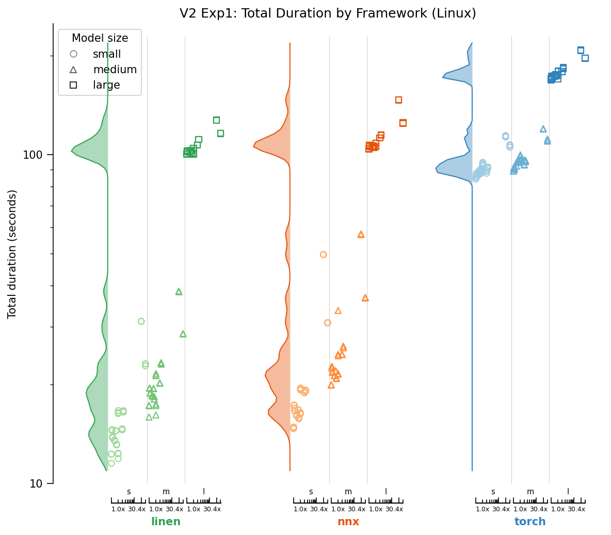
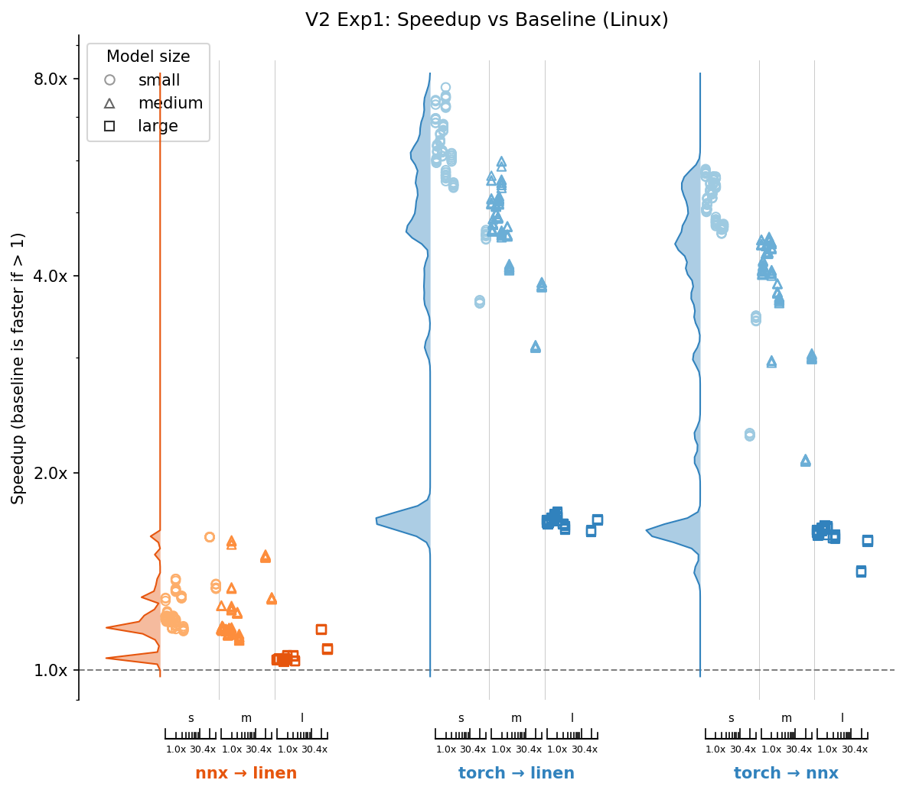
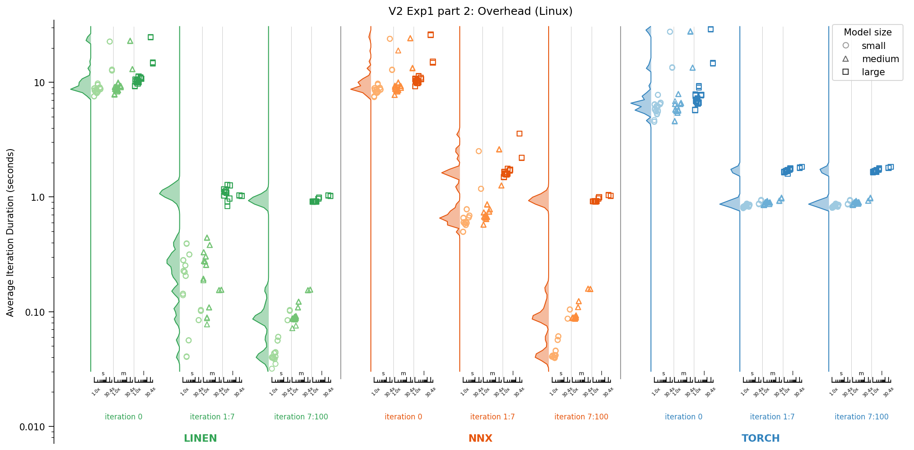
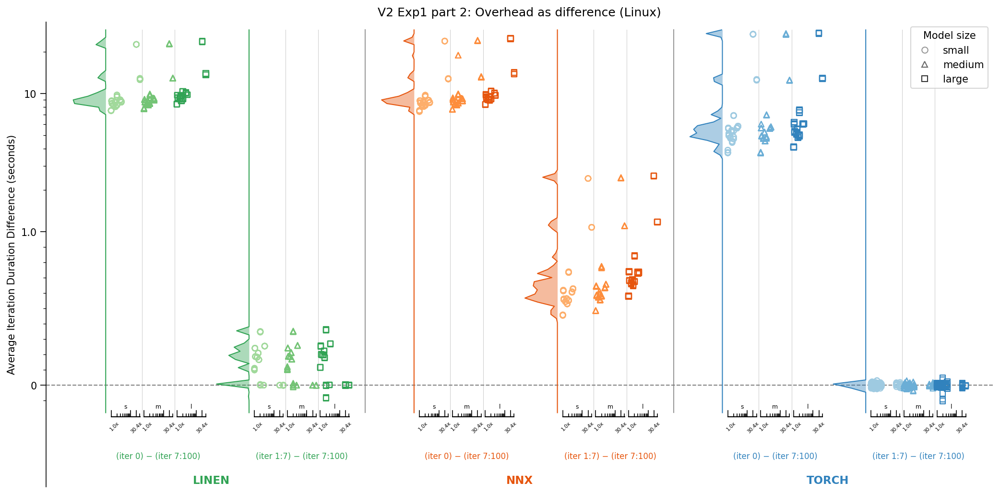
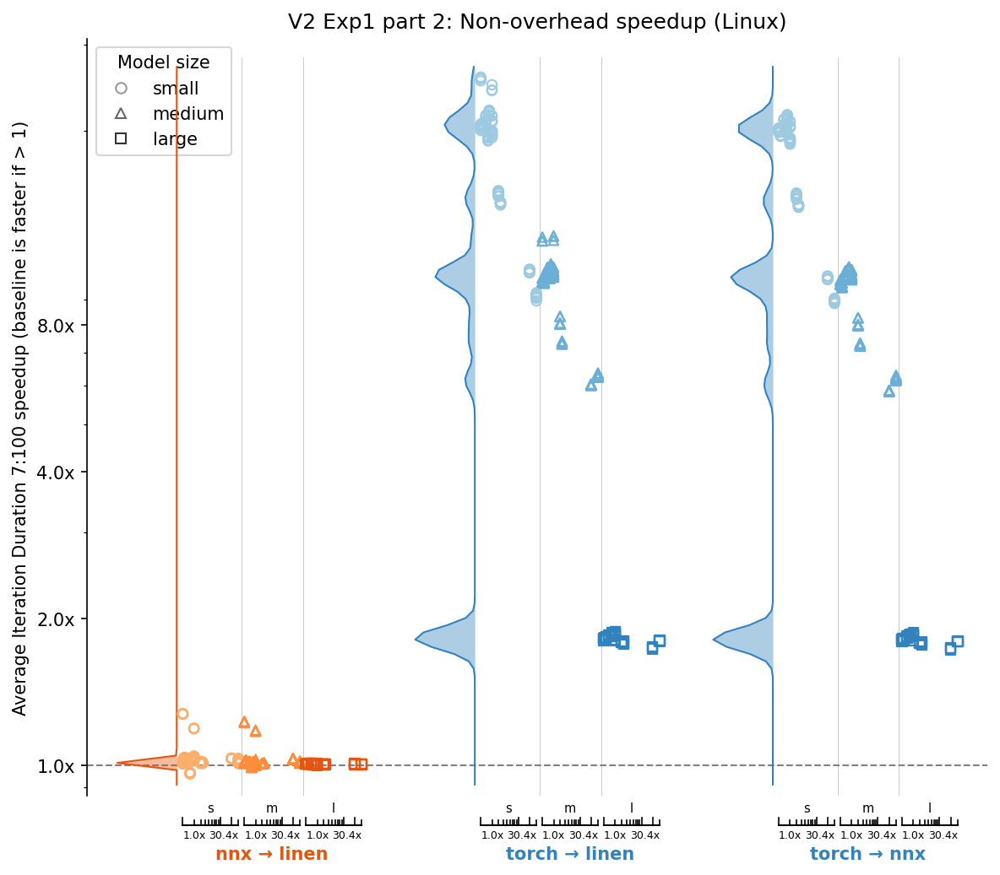
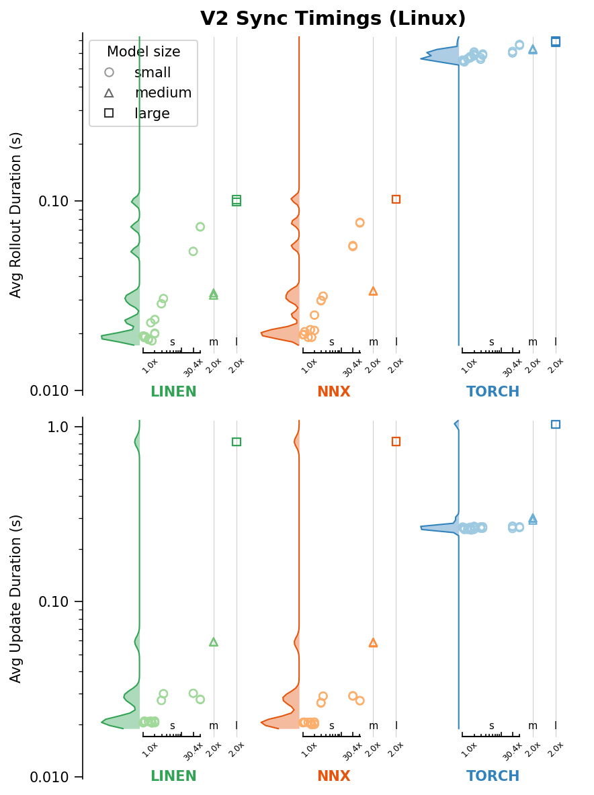
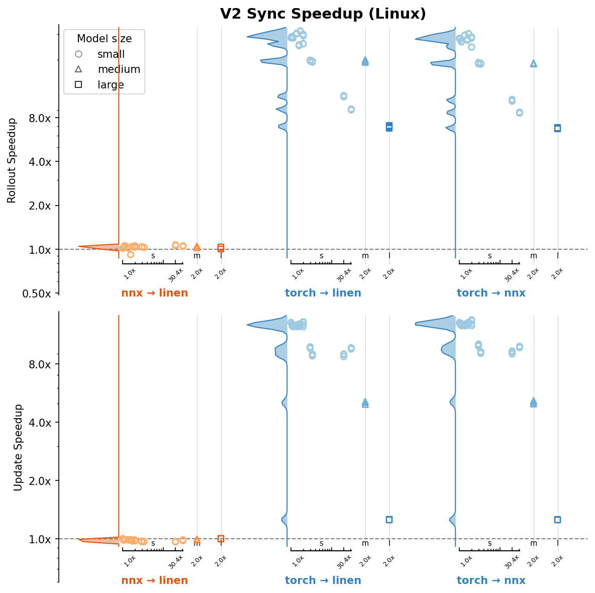
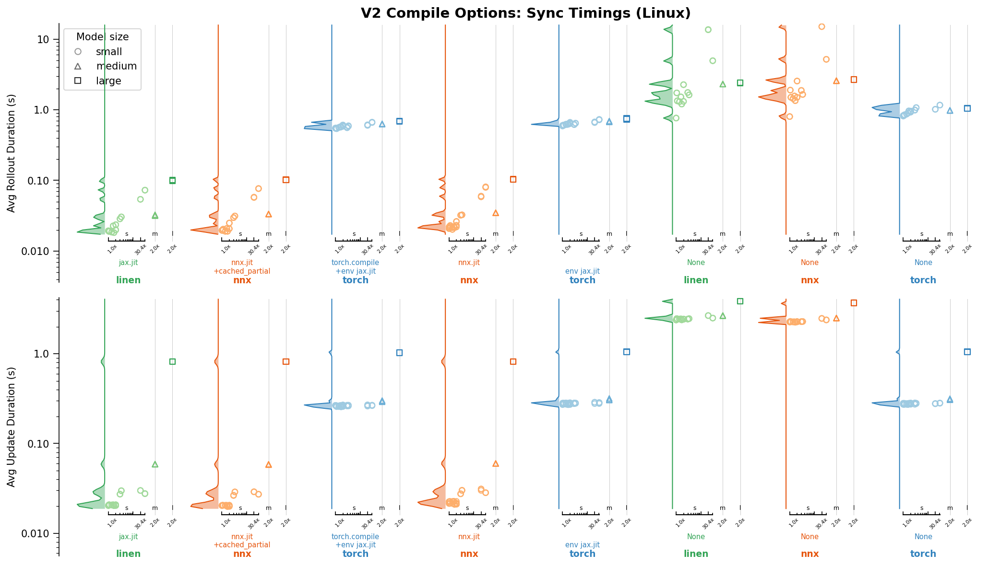
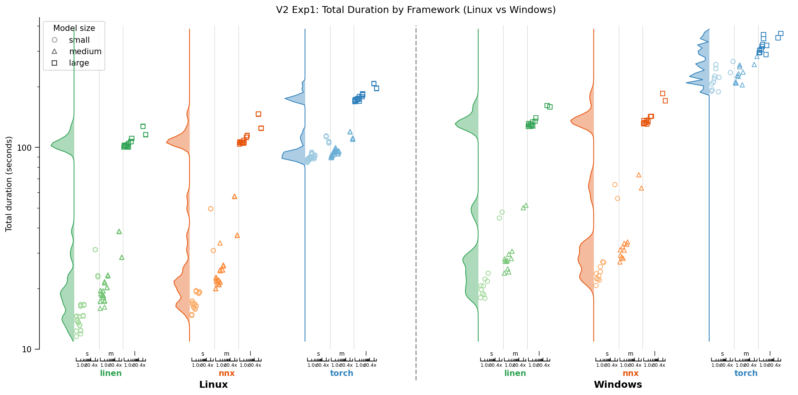
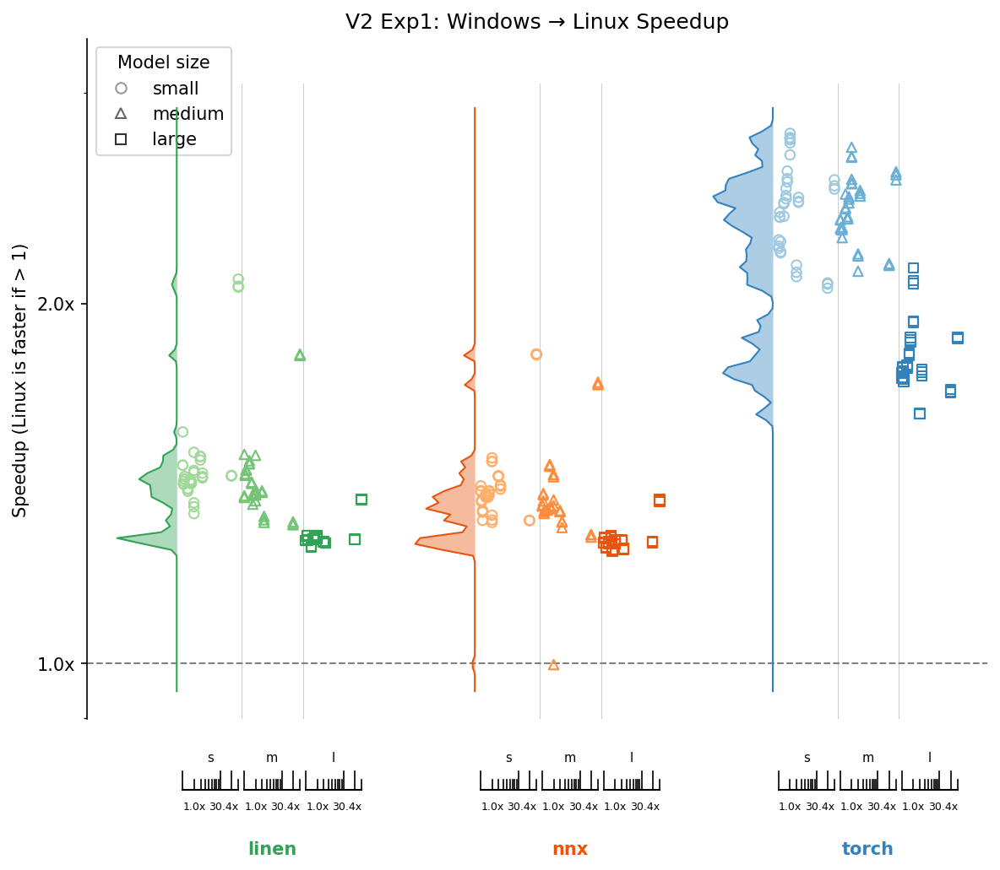

# benchback-rl
**Benchmarking Backends for Reinforcement Learning**: Flax.NNX (JAX) vs Flax.Linen (JAX) vs PyTorch

In this project I present high quality implentations of Proximal Policy Optimization (PPO) in multiple frameworks, while using GPU environments implemented in JAX from the Gymnax repository.

I compare the performance of the frameworks and analyse how their performance differs.

The purpose of this repository is to inform the choice of framework for new RL projects, including my own. It is also a good starting point for starting your own repository in a new framework if you haven't used it before, being able to compare it to other frameworks you might be more familiar with.

# Results Summary
Overall, Linen is the fastest, NNX marginally slower, and Torch is much slower. In all cases, the effect is less prenounced with larger models and more complex environments. Note that the most complex environments in this experiment are still small and fast. Overall, if the RL application requires large models and the environment takes a lot of time to compute (even more so for CPU environments), the choice of framework should matter less. Also, NNX only has larger overheads than Linen and their performance is almost identical for most of training. NNX and Linen should therefore perform almost identically in practical applications.

- Overall metrics:
    - For small models, Linen is 1.2x faster than NNX and 6x faster than torch
    - For large models, Linen is 1.05x faster than NNX and 1.7x faster than torch
    - If we ignore overheads, Linen is only 1.02x faster than NNX
- Ease of use
    - Torch is the easiest to use: good documentation, easy to understand code
    - Linen is the hardest to use: decent documentation, but hardest to code in. Anything that needs to be efficient and compiled with jax.jit must be fully functional and not stateful. It also requires specifc patterns, like having separate model parameters from the model structure. It also requires the use of efficient jax control flow like instead of native python if/for control flow, to achieve GPU efficiency. Although this is more difficult to code in, it's necessary for efficiency and I like it.
    - NNX: bad documentation, but allows for a nicer stateful object oriented approach than linen. NNX still requires special control flow like linen, but that's necessary for efficiency. NNX is still in beta though, and that can really be felt with missing documentation.

Out of these frameworks, I am tempted to use NNX in my next personal project. Over time, as it matures, it has the best potential in my eyes. Although I want to add a comparison to Equinox before making a decision.

Note that Linen and NNX have somewhat of an unfair advantage in this comparison, because the environment is run in JAX on GYMNAX on the GPU. This means that we need to transfer tensors from JAX to Torch using DLPack, which could contribute to the slowdown. However, if we used a CPU environment, the overhead from that would most likely completely overshadow the performance of these frameworks. In other words, implementing environments that can run on the GPU is likely even more important than choice of framework.

# Results
The charts shown visualise the distribution and a scatter plot of the individual results.

Each scatter plot has a small x axis which shows the environment's complexity. This complexity is calculated as a benchmarked amount of time it takes to perform a number of steps of the environment. We then divide the environment's step time by the fastest environment, to get 1x for the fastest environment and 30.4x for the slowest.

The model size is distinguished using the marker used, the shade of the colour of the marker, and visualy separated along the x axis into separate groups (s/m/l).

The distribution is calculated across all the environments and all the model sizes shown in the scatter.

## Experiment 1: Overall Performance
In the first experiment we time the total duration of training. We vary the model size (small, medium, large model) and the environment that we are training on. See the [Method](#method) section for details of the run.


Key observations from the experiment:
- Overall Framework performance: (quantified in next chart)
    - Linen is the fastest
    - NNX is marginally slower
    - Torch is much slower
- Model size influence:
    - Positive correlation between model size and total duration: Larger models take longer to run.
    - Torch exhibits a smaller proportional increase in total duration as model size grows compared to Linen/NNX. This suggests the presence of larger fixed overheads in Torch.
- Environment complexity influence:
    - Positive correlation between env complexity and total duration: Complex environments take longer to run.
    - Torch exhibits a smaller proportional increase in total duration as environment complexity grows to Linen/NNX. This also suggests the presence of largerfixed overheads in Torch.

To quantify differences between frameworks, we plot the speedup when moving from one framework to another. For each model and environment, we compute speedups as the ratio of their total duration, for all pairwise combinations of individual runs between frameworks (3x3 comparisons for three repeats).



Let's quantify the values seen in this chart, let's calculate the geometric mean and median values for each model size and framework pair in this chart:

<table>
<tr><td><strong>Geometric Mean Speedup</strong></td><td>Small</td><td>Medium</td><td>Large</td></tr>
<tr><td>NNX → Linen</td><td>1.25x</td><td>1.21x</td><td>1.05x</td></tr>
<tr><td>Torch → Linen</td><td>5.88x</td><td>4.62x</td><td>1.69x</td></tr>
<tr><td>Torch → NNX</td><td>4.70x</td><td>3.81x</td><td>1.60x</td></tr>
</table>

<table>
<tr><td><strong>Median Speedup</strong></td><td>Small</td><td>Medium</td><td>Large</td></tr>
<tr><td>NNX → Linen</td><td>1.20x</td><td>1.16x</td><td>1.04x</td></tr>
<tr><td>Torch → Linen</td><td>6.11x</td><td>4.77x</td><td>1.69x</td></tr>
<tr><td>Torch → NNX</td><td>5.07x</td><td>4.11x</td><td>1.62x</td></tr>
</table>

Key Observations:
- Model size influence:
    - Larger models lead to a smaller speedup (closer to 1x) that implies more similar performance across all frameworks with alrger models. This suggests that all frameworks perform their model calculations with more similar efficiency, and the differences in the framework performance comes from elsewhere.
- Environment complexity influence:
    - For NNX->Linen, we observe a larger speedup with more complex environments
    - For Torch->Linen and Torch->NNX, we observe a smaller speedup with more complex environments. Moreover, on large models, the effect of environment complexity is weaker.
    - This inconsistency suggests that the source of the speedup is different for different frameworks. We explore this further in [Experiment 2](#experiment-2-timing-rollout-and-update).

## Experiment 1 part 2: Overhead
Let us examine the overhead in the runs from experiment 1. We compare the duration of the first iteration (index `0`), to the average duration of the next 7 iterations (indices `1:7`), to the average of the remaining iterations (indices `7:100`).



To better inspect the overhead, let us also plot the difference between the iteration durations for all pairwise combination of runs with the same model size and environment. Let us draw this on a symlog axis that is linear below 0.1 and logarithmic above.



Key observations:
- Initial overhead in iteration `0`:
    - The initial overhead is similarly large for both Linen and NNX.
    - Torch has the smallest overhead for most environments. This could be because of the jit compilation taking a long time for Linen and NNX.
    - The runs with the two most complex environments (Freeway-MinAtar and Asterix-MinAtar) have a much larger overhead than any other runs, across all frameworks. There must therefore be overhead that is related to the environments, which could also be the jax.jit operation used within the Gymnax environments.
    - Larger models have a slightly larger overhead.
- Secondary overhead in iterations `1:7`:
    - Linen has zero secondary overhead for runs with some environments, and a small overhead for other environments. The secondary overheads in Linen must therefore be exclusively environment related.
    - NNX has secondary overheads that are larger with larger models, and larger environments.
    - Torch has no secondary overhead and its iteration time staibilises immediately on the second iteration.

Let us also examine the relative speedup between the frameworks of the duration of iterations 7:100.



We can see the same patter to [experiment 1](#experiment-1-overall-performance) with one notable exception: NNX and Linen have almost identical performance. This means NNX only has more overhead than Linen and performs almost identically afterwards. As training runs get longer, which is likely in practical applications, the difference between NNX and Linen is likely to get smaller.


## Experiment 2: Timing Rollout and Update
Next let us inspect the durations of the rollout step and the update step from a single iteration separately. Rollout is heavy on environment computation and light for model usage, while update doesn't use the environment at all and performs a lot of model computations.

To time these functions properly, we must force a synchronisation around their exection to ensure that they finished computing when the time is taken. This can reduce the overall efficiency, however, it does not interrupt operations within jitted or otherwise compiled functions, only around them.

In this experiment, we only run all environments for the small model size, while the medium and large models are only run with the Acrobot-v1 environment.

First, let us plot the average rollout and update duration from iterations 7:100.



Then let's compare the speedup between frameworks.



Key observations:
- Environment influence:
    - More complex environments lead to a larger rollout duration across all frameworks.
    - More complex environments lead to larger update durations only for some environments. These are the 4 most complex environments which are the Atari environments that have a much larger observation space (multiple hunderds of features instead of 6 or fewer). This means that the their models have more features, which affects the model's overall computational cost.
- Model size influence:
    - The model size has a much larger effect on the update speedup than it does on rollout duration, as expected.
- Framework comparison
    - NNX -> Linen, NNX is slightly slower than Linen on the Rollout Duration, while slightly faster on Update Duration. This effect is very small though. Linen and NNX perform almost identically.

## Experiment 3: Different Compilations
Lastly, let us examine the effect of different compilation methods on the different frameworks by examining the performance after the compilations are turned off. Since the jit operations are applied directly to the rollout and update functions, let us examine their average durations for iterations 7:100.

- For Linen, we use jax.jit for the entire rollout and update functions. These functions include the gymnax environment computations. When turned off, Gymnax still automatically applies some jax.jit compilation to the model.
- NNX has been compiled using nnx.jit and nnx.cached_partial for the rollout and update steps.
- The torch model has been compiled using torch.compile, and a jax.jit around the environment explicitly.



Key observations:
- Torch is mostly unaffected by compilation for both Rollout and Update Durations. There is only a slight increase in rollout duration when the envronment jax.jit compilation is turned off.
- For NNX, when turning off nnx.cached_partial, there is a slight increase in both Rollout Duration and Update duration.
- For both NNX and Linen, when turning off jitting, the performance drops massively. Both frameworks behave amost identically, but are both are slower than Torch (with the exception of a single environment).

This suggests that the speedup observed in Linen and NNX over Torch is indeed due to the jit compilation, which allows for many small GPU operations to run very effectively within a single kernel. All of their benefit is lost when jit is not used. Moreover, since they are not designed to be used without jit, their performance drops even beyond Torch.

## Experiment 4: Comparison to Windows
All previous experiments have been run on Linux (Ubuntu), with the Nvidia 508.126.09 driver inside Docker containers.

I also ran the same experiments on Windows, inside Docker containers running inside WSL2. (Although I only ran every experiment once instead of three times)

To my surprise, I found performance on Windows much worse than on Linux natively. The full set of plots on windows can be found in the results directory, while the following two plots compare the overall performance on Experiment 1:



And to quantify the comparison between the operating systems:



- We can see that Windows is slower across all frameworks, but the slowdown is stronger for Torch than it is for Linen and NNX.
- Runs with larger models are affected less by the OS across all frameworks.
- The OS slowdown varies with environments without a clear trend.

# Hyperparameters and Experimental setup

# Installation and Setup

# Developer Notes
## Warnings and Bugs encountered

## TODO and future plans

### TODO
- [x] Implement PPO in PyTorch
- [x] Implement PPO in Jax, Flax.Linen
- [x] Implement PPO in Jax, Flax.NNX
- [x] Implement entrypoints and benchmarking experiments
- [x] Test and debug everything
- [ ] Finalise Documentation and this readme
- [x] Run all benchmarks
- [x] Analyse results and present findings in readme

### Future work
- [ ] Also compare to Equinox
- [ ] Also compare to CPU environments.
- [ ] Also compare to large and expensive GPU environments.
- [ ] Also compare to PyTorch jit

<!-- 
# The rest of this readme is outdated and is only kept for copy pasting.

## Experiment 1: All Environments, Small model
### Method
This experiment compares the total training time of the following:

- For each Gymnax environment in ["CartPole-v1", "Acrobot-v1", "MountainCar-v0", "DiscountingChain-bsuite", "MemoryChain-bsuite", "UmbrellaChain-bsuite", "BernoulliBandit-misc", "GaussianBandit-misc"]
- For each framework in [Linen, NNX, Torch]
- For each OS in [Linux, Windows]
- Repeated 2x


With the follwing hyperparameters:
- number of parallel environments: 32
- number of steps in a rollout: 256
- number of minibatches per epoch: 8 (equivalent to minibatch size of 1024)
- number of epochs per update: 10
- number of iterations (rollout + update): 100

- model for both actor and critic: MLP with hidden sizes: [64,64]
    - 3 layers total:
        - `observation space size` -> `64`
        - `64` -> `64`
        - `64` -> (`1` for critic, `action space size` for actor)
    - Tanh activation function on hidden layers

- learning_rate: linear decay from 2.5e-4 to 0
- gamma = 0.99
- gae_lambda = 0.95
- clip_coef = 0.2
- ent_coef = 0.01
- vf_coef = 0.5
- max_grad_norm = 0.5
- adam_eps = 1e-5
- adam_betas = (0.9, 0.999)

### Results:
We can see the distribution of the total run duration over all environments and repeats in the following chart':


We can see that Linen is consistently the fastest, NNX is marginally slower, and Torch is much slower. We can also see that Windows is slower than Linux.

To answer the question of how much slower, look at the following chart:


We observe the following slowdowns between frameworks:
- Linen -> NNX: the slowdown is marginal, between 1.10x and 1.39x
- Linein -> Torch: the slowdown is large, between 5.65x and 9.29x

Moreover, we can see a general trend of a smaller framework slowdown when using larger environments. This makes sense, because the choice of framework doesn't affect the environment computation in JAX. Therefore, larger environment => smaller proportion of run is affected by slowdown => smaller overall slowdown.

As for the operating system, the slowdown from Linux -> Windows is worst for Torch and over 2x, while more marginal for Linen and NNX.

The influence of environment size on OS slowdown is incosistent. For linen, smaller environments lead to a larger slowdown. For torch, larger environments lead to a larger slowdown. My guess is that having torch loaded at the same time as jax causes a slowdown on windows drivers.

## Experiment 2: Acrobot-v1 environment, various model sizes
### Method
Similar to experiment 1, however, this time we keep the same environment and experiment with different model sizes:
- for each model in:
    - s: (hidden sizes: [64,64]),
    - m: (hidden sizes: [256,256,256]),
    - l: (hidden sizes: [1024,1024,1024,1024,1024,1024])
- for each framework in [Linen, NNX, Torch]
- for each os in [Linux, Windows]
- repeated 4x

### Results
We can see the distributions of the total run duration over the 4 repeats in the following chart:


We can observe that larger models take longer to run. To find out how much they affected the framework and os slowdown, see the following:


We can see that the larger the model, the smaller the slowdown. This makes sense, since all frameworks are optimised to run efficiently for the computation heavy model operations. The likely areas that affect the slowdown the most are the loops around the framework usage, which can be compiled using jax.jit (or nnx.jit), but not in Torch.

Neverthelles, for torch, even with the largest model on Linx (best case scenario), torch was slowed down 1.7x over linen.

## Experiment 3: Detailed analysis of timings
### Method
In this experiment, I synchronise the GPU to wait for all asynchronous operations to complete before timing individual elements in the run. At the cost of overall performance, I can compare how long individual parts of the run took.


## Installation & Setup

## Implementation Details and Design Choices
- Environments are implemented in pure JAX from the Gymnax repository and are run on the GPU.
- PPO implementation is simple, only using the core implementation details from:
    - https://iclr-blog-track.github.io/2022/03/25/ppo-implementation-details/
    - Only discreet action spaces
    - Only tabular inputs (no images / ATARI)
    - No recurrent networks
- PPO does not distinguish between truncated and terminated environments - Gymnax follows the OpenAI Gym pre-v0.26 API, which provides a single `done` signal. All `done=True` episodes are treated as terminal (no value bootstrapping, bootstrap value is zero).


## Work in progress & TODO
This repository is unfinished. I am actively working on it and it should be done in the next weeks.

### TODO
- [x] Implement PPO in PyTorch
- [x] Implement PPO in Jax, Flax.Linen
- [x] Implement PPO in Jax, Flax.NNX
- [x] Implement entrypoints and benchmarking experiments
- [x] Test and debug everything
- [ ] Finalise Documentation and this readme
- [x] Run all benchmarks
- [ ] Analyse results and present findings in readme

### Future work
- [ ] Also compare to CPU environments.
- [ ] Also compare to large and expensive GPU environments.
- [ ] Also compare to PyTorch jit

### Current bugs and problems
- The use of different drivers for jax and torch may still be a problem. It doesn't seem to slow anything down, like the transfer of data from jax to torch on the gpu using via DLPack, but vram usage may be affected and competing.

## imporant debugging findings
- flax.nnx cache_partial requires the annotation of static jax arrays or pytrees (specifically encountered with env.env_params) as Variables.
In future version of jax (0.12+) a static annotations exist. In this version (0.11) we need to treat it as a Variable even though its static.
- NNX causes a vram leak when running subsequent benchmarks in the same python script.
jax.clear_caches() mostly addresses the leak, although there may be small leaks left by nnx.cached_partial().
Some memory is also leaked and gc.collect() limits that across all frameworks - this may not be a problem and automatic garbage collection may still work well when running out of memory.

# The rest of this readme is outdated

## Setup

### Environment Variables

This project uses two separate `.env` files:

#### 1. Docker User IDs (`setup/docker/.env`)

Run the setup script to create `setup/docker/.env` with your user/group IDs (required for proper file permissions in containers):

```bash
./setup/scripts/create-env.sh
```

This creates:
```
UID=1000
GID=1000
DOCKER_GID=999
```

#### 2. WandB Credentials (`.env`)

Copy the example file and add your WandB credentials:

```bash
cp .env.example .env
```

Then edit `.env`:
```
WANDB_API_KEY=your_api_key_here
WANDB_ENTITY=your_username_or_team
```

### Running Benchmarks

```bash
python -m benchback_rl.benchmarks.runner
```

## Repository Structure

### Packages and Installation
`setup/docker/Dockerfile.run` with `setup/docker/docker-compose.run.yml` is used to run benchmarks in a reproducible way using `requirements.txt`.

`setup/docker/Dockerfile.dev` with `setup/docker/docker-compose.dev.yml` and `.devcontainer/devcontainer.json` is used for development, installing dependencies from `pyproject.toml`. `setup/scripts/export_requirements.sh` is used to generate `requirements.txt` from within the development container.

This repo installs jax from the docker nvcr.io/nvidia/jax:25.10-py3 container for GPU support. It also installs torch with its bundled CUDA dependencies. This way each package is using its own CUDA libraries for best performance and compatibility at the cost of a larger container image.

### Implementations

All implementations follow the 13 core implementation details from [The 37 Implementation Details of Proximal Policy Optimization](https://iclr-blog-track.github.io/2022/03/25/ppo-implementation-details/).

#### Design Decisions

**Rollout Buffer Storage Layout**

The buffer stores transitions with the following semantics:
- `obs[t]` — observation fed to the network at step t
- `action[t]`, `log_prob[t]`, `value[t]` — network outputs given `obs[t]`
- `reward[t]`, `done[t]` — **result** of taking `action[t]` in the environment
- `obs[t+1]` — next observation (stored at next index)

This means `done[t]` indicates whether the episode ended *after* taking `action[t]`, not whether `obs[t]` is the first observation of a new episode. The buffer stores `num_steps + 1` observations (including the final bootstrap observation) but only `num_steps` of everything else.

**Termination vs Truncation**

Gymnax environments combine true terminations (agent reached terminal state) and truncations (time limit reached) into a single `done` flag. We accept this simplification, which introduces a small bias for truncated episodes: when an episode is truncated due to time limit, the bootstrap value should ideally be `V(final_obs)` rather than 0, since the episode could have continued. However:
1. For environments with natural termination conditions (CartPole, Atari), true terminations dominate
2. The bias is typically small for well-tuned time limits
3. Handling truncation separately would require modifications to gymnax or manual time tracking

**Buffer Reset Behavior**

The buffer does NOT automatically carry forward the final observation to the next rollout. The caller must explicitly:
1. Call `buffer.reset()` to clear the step counter
2. Call `buffer.set_initial_obs(obs)` with the appropriate starting observation

This explicit API prevents subtle bugs where stale observations might be used.

#### PyTorch
Located in `src/benchback_rl/rl_torch/`, this RL implementation uses PyTorch with an object oriented design. The main training loop is in `train.py`, while the model definitions are in `models.py`. It uses environments that are running on the GPU via `gymnax` using JAX, transferring tensors between PyTorch and JAX using DLPack for efficiency.
#### JAX (Flax.NNX)
Located in `src/benchback_rl/rl_jax_nnx/`, this RL implementation uses JAX with the Flax.NNX library. The design is object oriented, similar to the PyTorch implementation, while allowing jittable jax exectution under the hood, as per Flax.NNX's design philosophy. The main training loop is in `train.py`, while the model definitions are in `models.py`.
#### JAX (Flax.Linen)
Located in `src/benchback_rl/rl_jax_linen/`, this RL implementation uses JAX with the Flax.Linen library. The design is functional, following Flax.Linen's design philosophy. The main training loop is in `train.py`, while the model definitions are in `models.py`.
 -->
