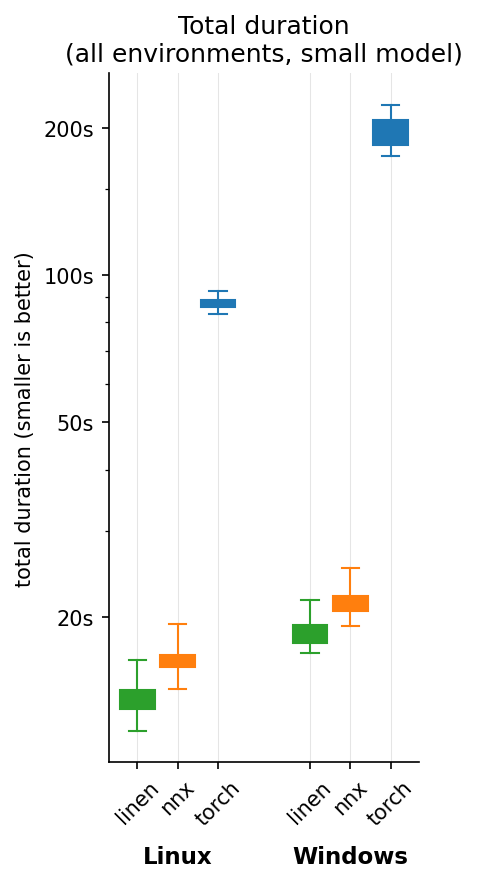
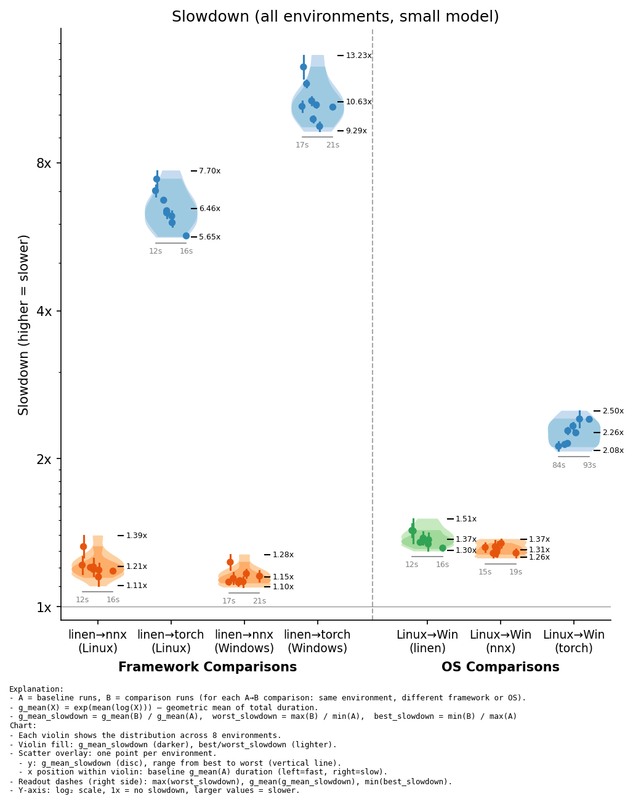
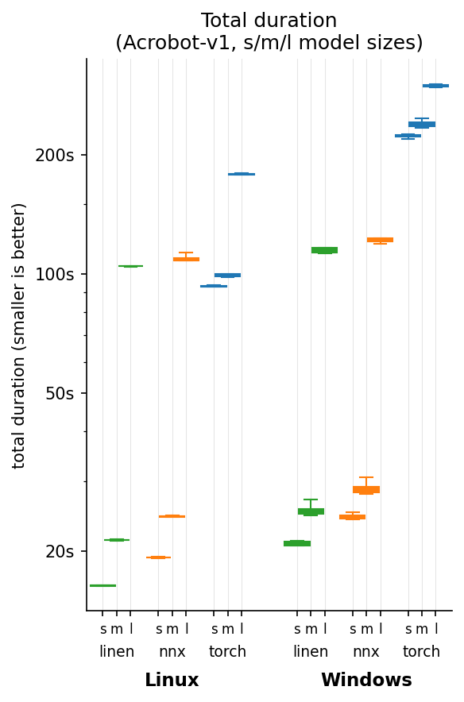
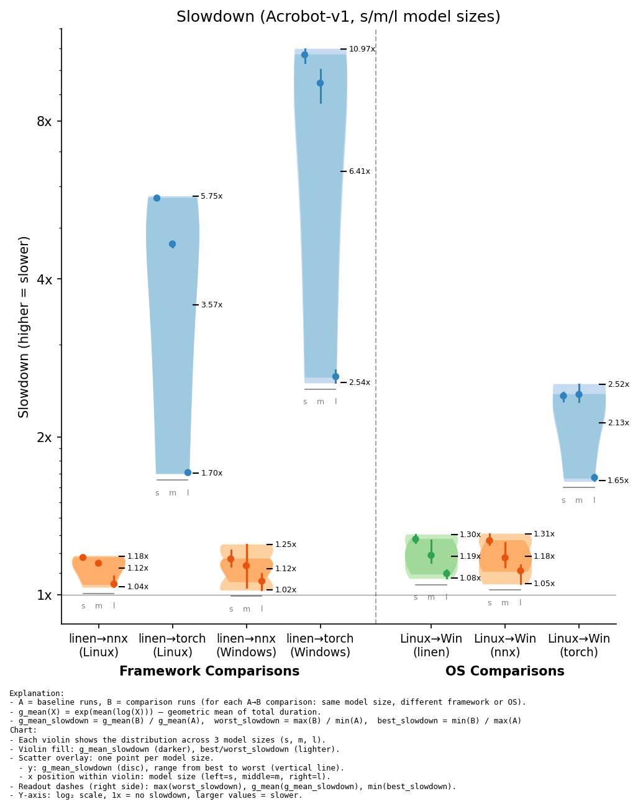

# benchback-rl
**Benchmarking Backends for Reinforcement Learning**: Flax.NNX (JAX) vs Flax.Linen (JAX) vs PyTorch

In this project I present high quality implentations of Proximal Policy Optimization (PPO) in multiple frameworks, while using GPU environments implemented in JAX from the Gymnax repository.

I compare the performance of the frameworks and their ease of use with best coding practices.

## Results Summary
- Linen is the fastest and most difficult to use.
- NNX is marginally slower than Linen, but nicer to use. Although documentation is lacking and it is still in early development.
- Torch is much much slower than both NNX and Linen. Although it is much nicer to use (both in terms of implementation and documentation).
- Running benchmarks on Windows via Docker running in WSL is slower than running Docker natively in Linux (Ubuntu).

I will be using NNX in my next RL project.

## Experiment 1: All Environments, Small model
### Method
This experiment compares the total training time of the following:

- For each Gymnax environment in ["CartPole-v1", "Acrobot-v1", "MountainCar-v0", "DiscountingChain-bsuite", "MemoryChain-bsuite", "UmbrellaChain-bsuite", "BernoulliBandit-misc", "GaussianBandit-misc"]
- For each framework in [Linen, NNX, Torch]
- For each OS in [Linux, Windows]
- Repeated 2x


With the follwing hyperparameters:
- number of parallel environments: 32
- number of steps in a rollout: 256
- number of minibatches per epoch: 8 (equivalent to minibatch size of 1024)
- number of epochs per update: 10
- number of iterations (rollout + update): 100

- model for both actor and critic: MLP with hidden sizes: [64,64]
    - 3 layers total:
        - `observation space size` -> `64`
        - `64` -> `64`
        - `64` -> (`1` for critic, `action space size` for actor)
    - Tanh activation function on hidden layers

- learning_rate: linear decay from 2.5e-4 to 0
- gamma = 0.99
- gae_lambda = 0.95
- clip_coef = 0.2
- ent_coef = 0.01
- vf_coef = 0.5
- max_grad_norm = 0.5
- adam_eps = 1e-5
- adam_betas = (0.9, 0.999)

### Results:
We can see the distribution of the total run duration over all environments and repeats in the following chart':



We can see that Linen is consistently the fastest, NNX is marginally slower, and Torch is much slower. We can also see that Windows is slower than Linux.

To answer the question of how much slower, look at the following chart:



We observe the following slowdowns between frameworks:
- Linen -> NNX: the slowdown is marginal, between 1.10x and 1.39x
- Linein -> Torch: the slowdown is large, between 5.65x and 9.29x

Moreover, we can see a general trend of a smaller framework slowdown when using larger environments. This makes sense, because the choice of framework doesn't affect the environment computation in JAX. Therefore, larger environment => smaller proportion of run is affected by slowdown => smaller overall slowdown.

As for the operating system, the slowdown from Linux -> Windows is worst for Torch and over 2x, while more marginal for Linen and NNX.

The influence of environment size on OS slowdown is incosistent. For linen, smaller environments lead to a larger slowdown. For torch, larger environments lead to a larger slowdown. My guess is that having torch loaded at the same time as jax causes a slowdown on windows drivers.

## Experiment 2: Acrobot-v1 environment, various model sizes
### Method
Similar to experiment 1, however, this time we keep the same environment and experiment with different model sizes:
- for each model in:
    - s: (hidden sizes: [64,64]),
    - m: (hidden sizes: [256,256,256]),
    - l: (hidden sizes: [1024,1024,1024,1024,1024,1024])
- for each framework in [Linen, NNX, Torch]
- for each os in [Linux, Windows]
- repeated 4x

### Results
We can see the distributions of the total run duration over the 4 repeats in the following chart:



We can observe that larger models take longer to run. To find out how much they affected the framework and os slowdown, see the following:



We can see that the larger the model, the smaller the slowdown. This makes sense, since all frameworks are optimised to run efficiently for the computation heavy model operations. The likely areas that affect the slowdown the most are the loops around the framework usage, which can be compiled using jax.jit (or nnx.jit), but not in Torch.

Neverthelles, for torch, even with the largest model on Linx (best case scenario), torch was slowed down 1.7x over linen.

## Experiment 3: Detailed analysis of timings
### Method
In this experiment, I synchronise the GPU to wait for all asynchronous operations to complete before timing individual elements in the run. At the cost of overall performance, I can compare how long individual parts of the run took.


## Installation & Setup

## Implementation Details and Design Choices
- Environments are implemented in pure JAX from the Gymnax repository and are run on the GPU.
- PPO implementation is simple, only using the core implementation details from:
    - https://iclr-blog-track.github.io/2022/03/25/ppo-implementation-details/
    - Only discreet action spaces
    - Only tabular inputs (no images / ATARI)
    - No recurrent networks
- PPO does not distinguish between truncated and terminated environments - Gymnax follows the OpenAI Gym pre-v0.26 API, which provides a single `done` signal. All `done=True` episodes are treated as terminal (no value bootstrapping, bootstrap value is zero).


## Work in progress & TODO
This repository is unfinished. I am actively working on it and it should be done in the next weeks.

### TODO
- [x] Implement PPO in PyTorch
- [x] Implement PPO in Jax, Flax.Linen
- [x] Implement PPO in Jax, Flax.NNX
- [x] Implement entrypoints and benchmarking experiments
- [x] Test and debug everything
- [ ] Finalise Documentation and this readme
- [x] Run all benchmarks
- [ ] Analyse results and present findings in readme

### Future work
- [ ] Also compare to CPU environments.
- [ ] Also compare to large and expensive GPU environments.
- [ ] Also compare to PyTorch jit

### Current bugs and problems
- The use of different drivers for jax and torch may still be a problem. It doesn't seem to slow anything down, like the transfer of data from jax to torch on the gpu using via DLPack, but vram usage may be affected and competing.

## imporant debugging findings
- flax.nnx cache_partial requires the annotation of static jax arrays or pytrees (specifically encountered with env.env_params) as Variables.
In future version of jax (0.12+) a static annotations exist. In this version (0.11) we need to treat it as a Variable even though its static.
- NNX causes a vram leak when running subsequent benchmarks in the same python script.
jax.clear_caches() mostly addresses the leak, although there may be small leaks left by nnx.cached_partial().
Some memory is also leaked and gc.collect() limits that across all frameworks - this may not be a problem and automatic garbage collection may still work well when running out of memory.

# The rest of this readme is outdated

## Setup

### Environment Variables

This project uses two separate `.env` files:

#### 1. Docker User IDs (`setup/docker/.env`)

Run the setup script to create `setup/docker/.env` with your user/group IDs (required for proper file permissions in containers):

```bash
./setup/scripts/create-env.sh
```

This creates:
```
UID=1000
GID=1000
DOCKER_GID=999
```

#### 2. WandB Credentials (`.env`)

Copy the example file and add your WandB credentials:

```bash
cp .env.example .env
```

Then edit `.env`:
```
WANDB_API_KEY=your_api_key_here
WANDB_ENTITY=your_username_or_team
```

### Running Benchmarks

```bash
python -m benchback_rl.benchmarks.runner
```

## Repository Structure

### Packages and Installation
`setup/docker/Dockerfile.run` with `setup/docker/docker-compose.run.yml` is used to run benchmarks in a reproducible way using `requirements.txt`.

`setup/docker/Dockerfile.dev` with `setup/docker/docker-compose.dev.yml` and `.devcontainer/devcontainer.json` is used for development, installing dependencies from `pyproject.toml`. `setup/scripts/export_requirements.sh` is used to generate `requirements.txt` from within the development container.

This repo installs jax from the docker nvcr.io/nvidia/jax:25.10-py3 container for GPU support. It also installs torch with its bundled CUDA dependencies. This way each package is using its own CUDA libraries for best performance and compatibility at the cost of a larger container image.

### Implementations

All implementations follow the 13 core implementation details from [The 37 Implementation Details of Proximal Policy Optimization](https://iclr-blog-track.github.io/2022/03/25/ppo-implementation-details/).

#### Design Decisions

**Rollout Buffer Storage Layout**

The buffer stores transitions with the following semantics:
- `obs[t]` — observation fed to the network at step t
- `action[t]`, `log_prob[t]`, `value[t]` — network outputs given `obs[t]`
- `reward[t]`, `done[t]` — **result** of taking `action[t]` in the environment
- `obs[t+1]` — next observation (stored at next index)

This means `done[t]` indicates whether the episode ended *after* taking `action[t]`, not whether `obs[t]` is the first observation of a new episode. The buffer stores `num_steps + 1` observations (including the final bootstrap observation) but only `num_steps` of everything else.

**Termination vs Truncation**

Gymnax environments combine true terminations (agent reached terminal state) and truncations (time limit reached) into a single `done` flag. We accept this simplification, which introduces a small bias for truncated episodes: when an episode is truncated due to time limit, the bootstrap value should ideally be `V(final_obs)` rather than 0, since the episode could have continued. However:
1. For environments with natural termination conditions (CartPole, Atari), true terminations dominate
2. The bias is typically small for well-tuned time limits
3. Handling truncation separately would require modifications to gymnax or manual time tracking

**Buffer Reset Behavior**

The buffer does NOT automatically carry forward the final observation to the next rollout. The caller must explicitly:
1. Call `buffer.reset()` to clear the step counter
2. Call `buffer.set_initial_obs(obs)` with the appropriate starting observation

This explicit API prevents subtle bugs where stale observations might be used.

#### PyTorch
Located in `src/benchback_rl/rl_torch/`, this RL implementation uses PyTorch with an object oriented design. The main training loop is in `train.py`, while the model definitions are in `models.py`. It uses environments that are running on the GPU via `gymnax` using JAX, transferring tensors between PyTorch and JAX using DLPack for efficiency.
#### JAX (Flax.NNX)
Located in `src/benchback_rl/rl_jax_nnx/`, this RL implementation uses JAX with the Flax.NNX library. The design is object oriented, similar to the PyTorch implementation, while allowing jittable jax exectution under the hood, as per Flax.NNX's design philosophy. The main training loop is in `train.py`, while the model definitions are in `models.py`.
#### JAX (Flax.Linen)
Located in `src/benchback_rl/rl_jax_linen/`, this RL implementation uses JAX with the Flax.Linen library. The design is functional, following Flax.Linen's design philosophy. The main training loop is in `train.py`, while the model definitions are in `models.py`.

