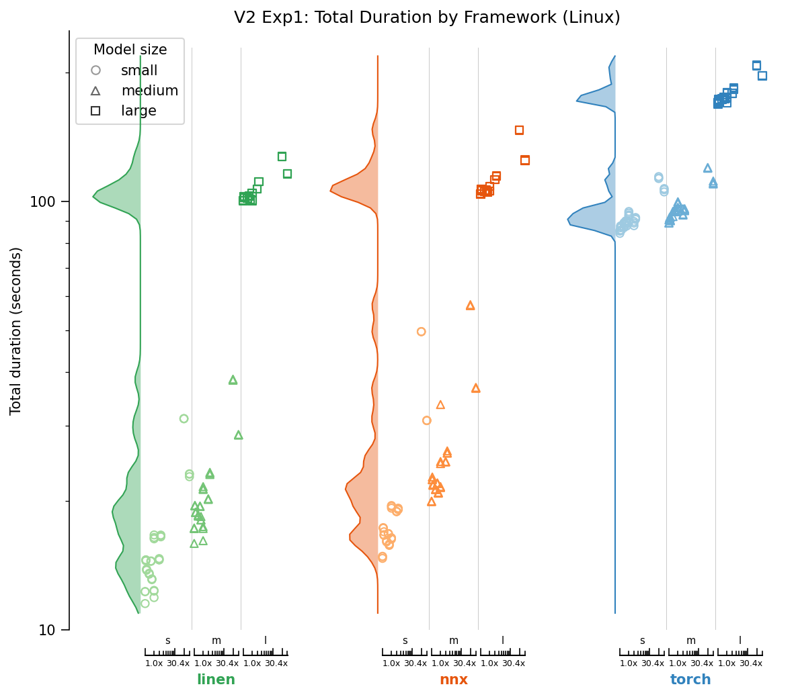
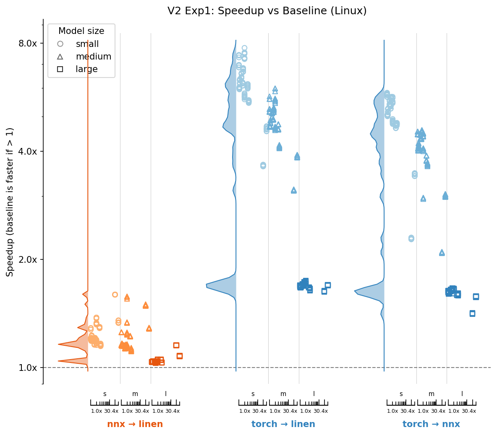
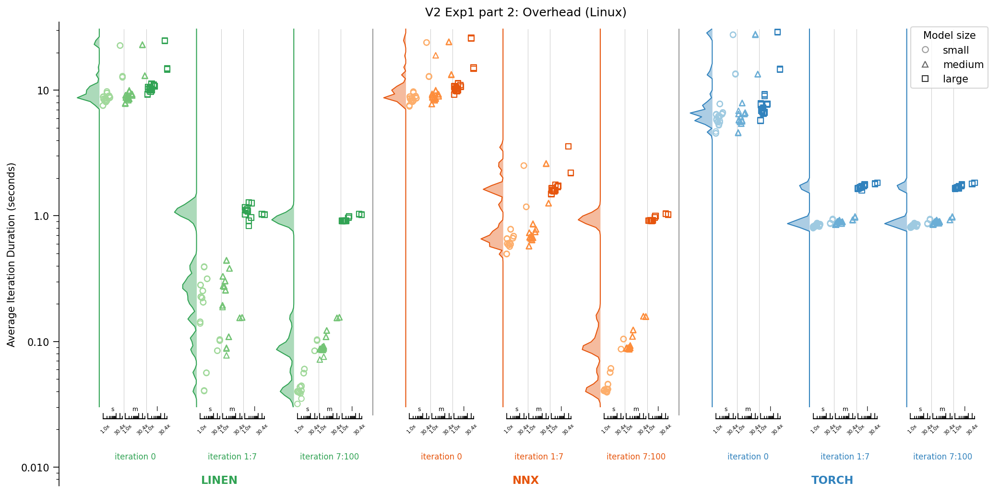
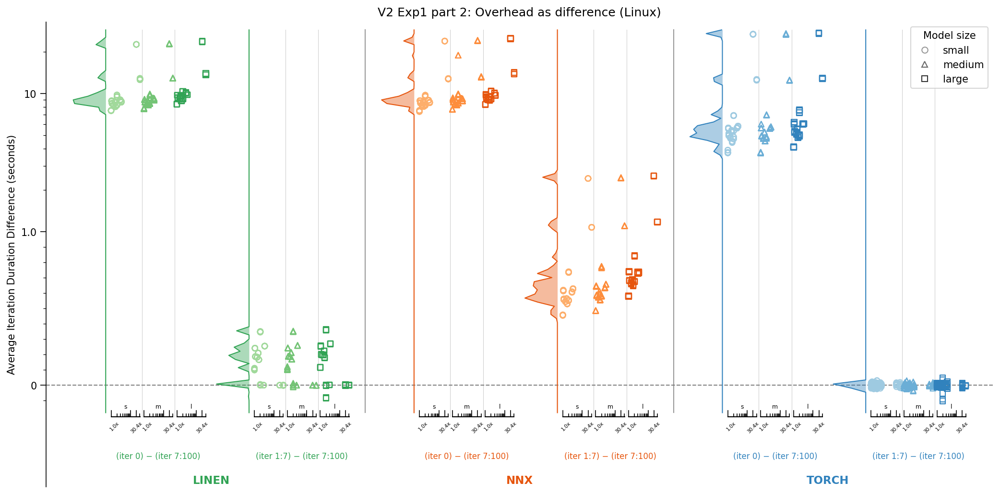
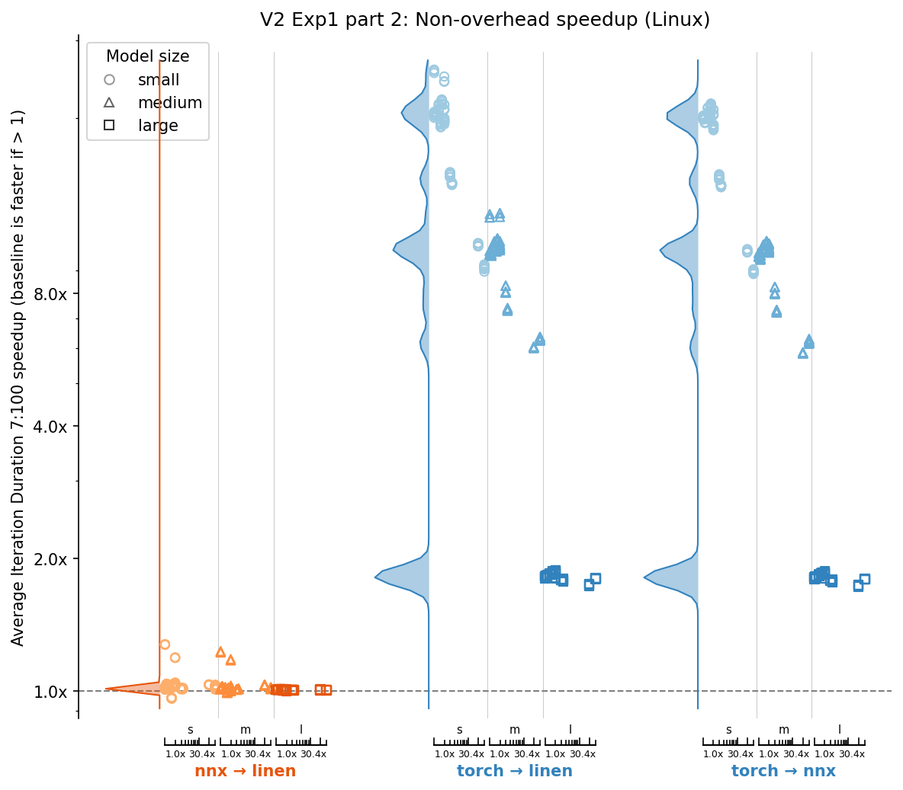
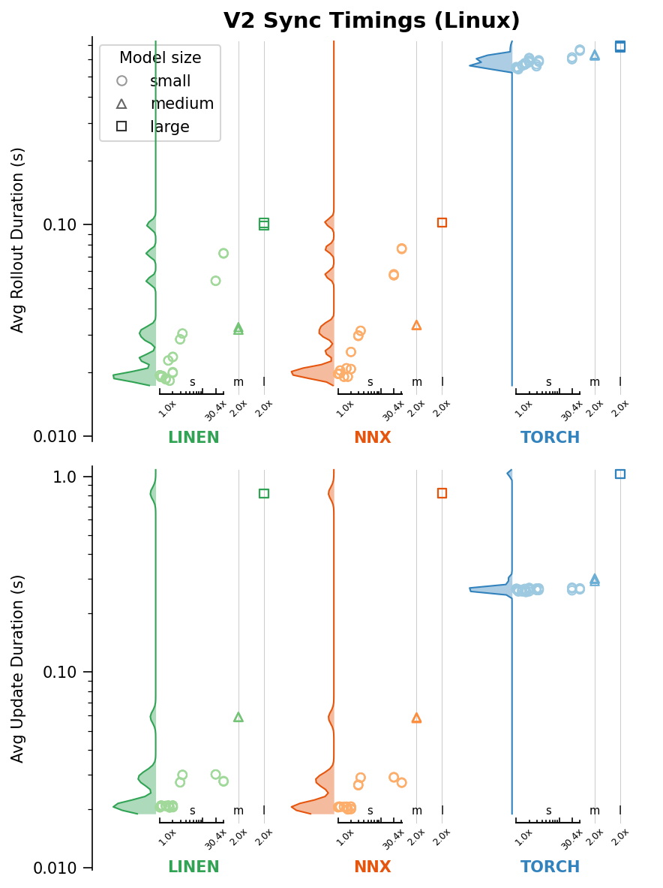
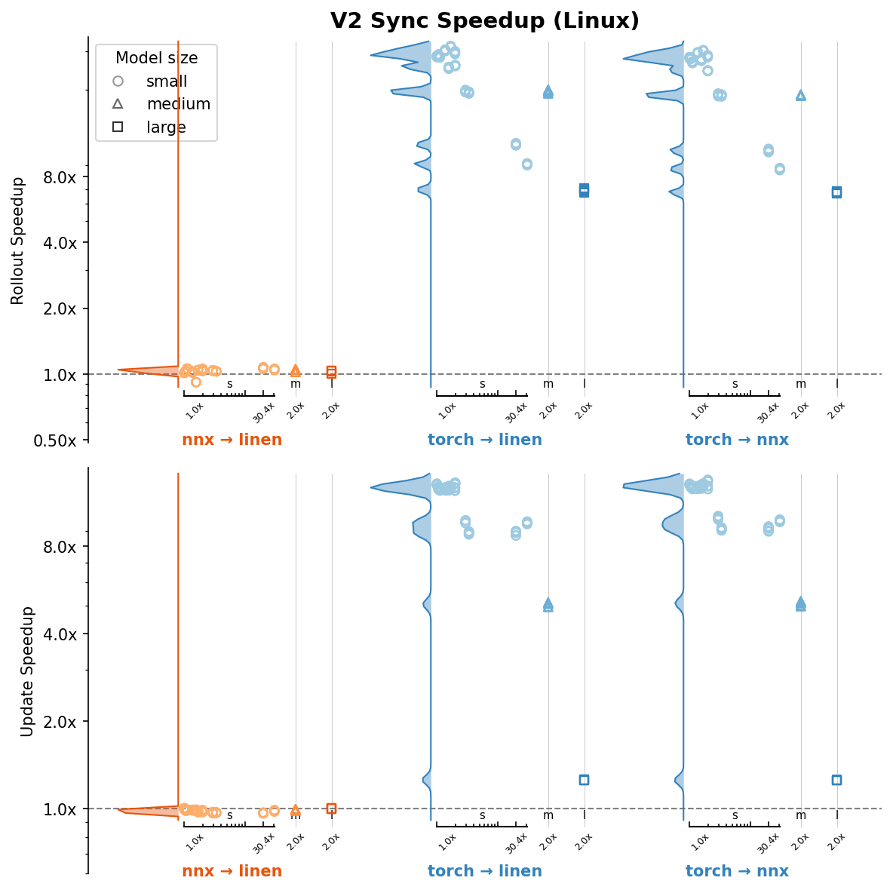
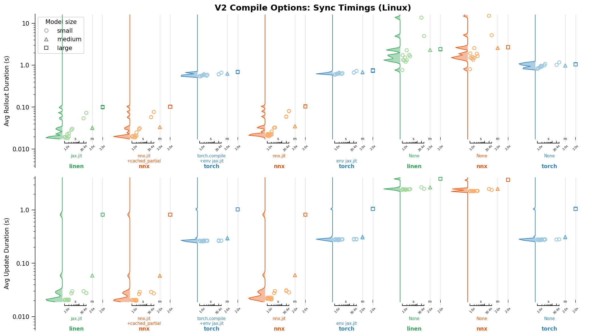
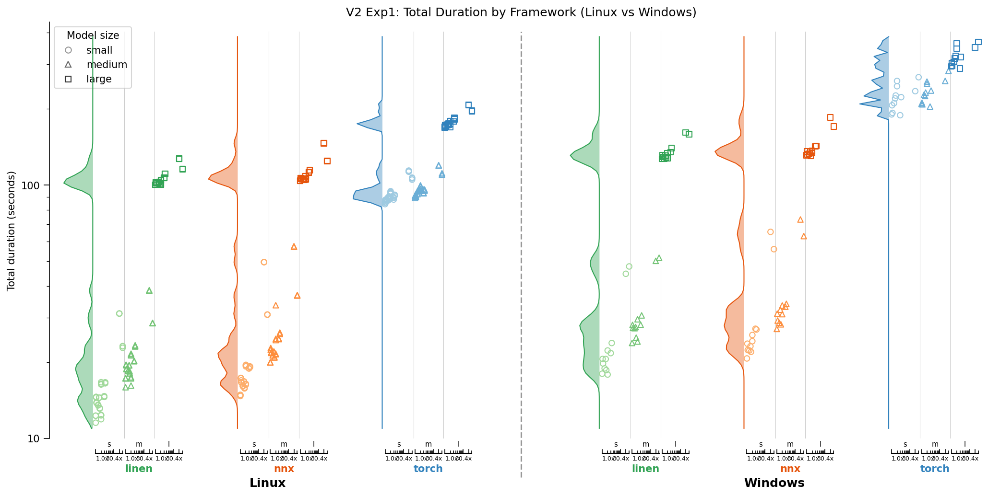
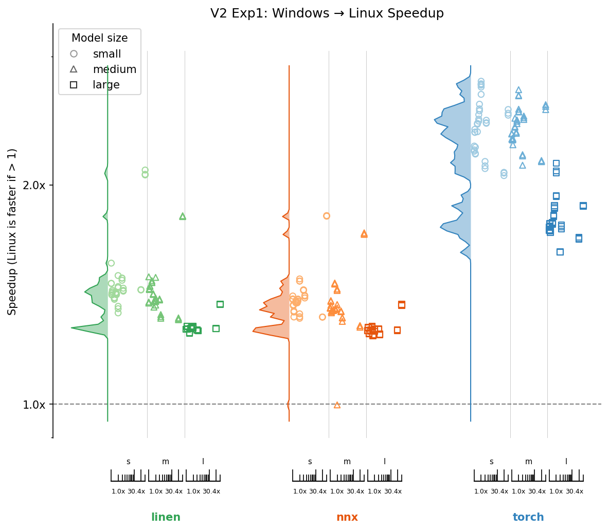

# benchback-rl
**Benchmarking Backends for Reinforcement Learning**: Flax.NNX (JAX) vs Flax.Linen (JAX) vs PyTorch

In this project I present high quality implementations of Proximal Policy Optimization (PPO) in multiple frameworks, while using GPU environments implemented in JAX from the Gymnax repository.

I compare the performance of the frameworks and analyse how their performance differs.

The purpose of this repository is to inform the choice of framework for new RL projects, including my own. It is also a good starting point for starting your own repository in a new framework if you haven't used it before, being able to compare it to other frameworks you might be more familiar with.

# Results Summary
Overall, Linen is the fastest, NNX marginally slower, and Torch is much slower. In all cases, the effect is less pronounced with larger models and more complex environments. Note that the most complex environments in this experiment are still small and fast. Overall, if the RL application requires large models and the environment takes a lot of time to compute (even more so for CPU environments), the choice of framework should matter less. Also, NNX only has larger overheads than Linen and their performance is almost identical for most of training. NNX and Linen should therefore perform almost identically in practical applications.

- Overall metrics:
    - For small models, Linen is 1.2x faster than NNX and 6x faster than torch
    - For large models, Linen is 1.05x faster than NNX and 1.7x faster than torch
    - If we ignore overheads, Linen is only 1.02x faster than NNX
- Ease of use
    - Torch is the easiest to use: good documentation, easy to understand code
    - Linen is the hardest to use: decent documentation, but hardest to code in. Anything that needs to be efficient and compiled with jax.jit must be fully functional and not stateful. It also requires specific patterns, like having separate model parameters from the model structure. It also requires the use of efficient jax control flow instead of native python if/for control flow, to achieve GPU efficiency. Although this is more difficult to code in, it's necessary for efficiency and I like it.
    - NNX: bad documentation, but allows for a nicer stateful object oriented approach than linen. NNX still requires special control flow like linen, but that's necessary for efficiency. NNX is still in beta though, and that can really be felt with missing documentation.

Out of these frameworks, I am tempted to use NNX in my next personal project. Over time, as it matures, it has the best potential in my eyes. Although I want to add a comparison to Equinox before making a decision.

Note that Linen and NNX have somewhat of an unfair advantage in this comparison, because the environment is run in JAX on GYMNAX on the GPU. This means that we need to transfer tensors from JAX to Torch using DLPack, which could contribute to the slowdown. However, if we used a CPU environment, the overhead from that would most likely completely overshadow the performance of these frameworks. In other words, implementing environments that can run on the GPU is likely even more important than choice of framework.

# Results
The charts shown visualise the distribution and a scatter plot of the individual results.

Each scatter plot has a small x axis which shows the environment's complexity. This complexity is calculated as a benchmarked amount of time it takes to perform a number of steps of the environment. We then divide the environment's step time by the fastest environment, to get 1x for the fastest environment and 30.4x for the slowest.

The model size is distinguished using the marker used, the shade of the colour of the marker, and visually separated along the x axis into separate groups (s/m/l).

The distribution is calculated across all the environments and all the model sizes shown in the scatter.

## Experiment 1: Overall Performance
In the first experiment we time the total duration of training. We vary the model size (small, medium, large model) and the environment that we are training on. See the [Method](#method) section for details of the run.


Key observations from the experiment:
- Overall Framework performance: (quantified in next chart)
    - Linen is the fastest
    - NNX is marginally slower
    - Torch is much slower
- Model size influence:
    - Positive correlation between model size and total duration: Larger models take longer to run.
    - Torch exhibits a smaller proportional increase in total duration as model size grows compared to Linen/NNX. This suggests the presence of larger fixed overheads in Torch.
- Environment complexity influence:
    - Positive correlation between env complexity and total duration: Complex environments take longer to run.
    - Torch exhibits a smaller proportional increase in total duration as environment complexity grows to Linen/NNX. This also suggests the presence of larger fixed overheads in Torch.

To quantify differences between frameworks, we plot the speedup when moving from one framework to another. For each model and environment, we compute speedups as the ratio of their total duration, for all pairwise combinations of individual runs between frameworks (3x3 comparisons for three repeats).



Let's quantify the values seen in this chart, let's calculate the geometric mean and median values for each model size and framework pair in this chart:

<table>
<tr><td><strong>Geometric Mean Speedup</strong></td><td>Small</td><td>Medium</td><td>Large</td></tr>
<tr><td>NNX → Linen</td><td>1.25x</td><td>1.21x</td><td>1.05x</td></tr>
<tr><td>Torch → Linen</td><td>5.88x</td><td>4.62x</td><td>1.69x</td></tr>
<tr><td>Torch → NNX</td><td>4.70x</td><td>3.81x</td><td>1.60x</td></tr>
</table>

<table>
<tr><td><strong>Median Speedup</strong></td><td>Small</td><td>Medium</td><td>Large</td></tr>
<tr><td>NNX → Linen</td><td>1.20x</td><td>1.16x</td><td>1.04x</td></tr>
<tr><td>Torch → Linen</td><td>6.11x</td><td>4.77x</td><td>1.69x</td></tr>
<tr><td>Torch → NNX</td><td>5.07x</td><td>4.11x</td><td>1.62x</td></tr>
</table>

Key Observations:
- Model size influence:
    - Larger models lead to a smaller speedup (closer to 1x) that implies more similar performance across all frameworks with larger models. This suggests that all frameworks perform their model calculations with more similar efficiency, and the differences in the framework performance comes from elsewhere.
- Environment complexity influence:
    - For NNX->Linen, we observe a larger speedup with more complex environments
    - For Torch->Linen and Torch->NNX, we observe a smaller speedup with more complex environments. Moreover, on large models, the effect of environment complexity is weaker.
    - This inconsistency suggests that the source of the speedup is different for different frameworks. We explore this further in [Experiment 2](#experiment-2-timing-rollout-and-update).

## Experiment 1 part 2: Overhead
Let us examine the overhead in the runs from experiment 1. We compare the duration of the first iteration (index `0`), to the average duration of the next 7 iterations (indices `1:7`), to the average of the remaining iterations (indices `7:100`).



To better inspect the overhead, let us also plot the difference between the iteration durations for all pairwise combination of runs with the same model size and environment. Let us draw this on a symlog axis that is linear below 0.1 and logarithmic above.



Key observations:
- Initial overhead in iteration `0`:
    - The initial overhead is similarly large for both Linen and NNX.
    - Torch has the smallest overhead for most environments. This could be because of the jit compilation taking a long time for Linen and NNX.
    - The runs with the two most complex environments (Freeway-MinAtar and Asterix-MinAtar) have a much larger overhead than any other runs, across all frameworks. There must therefore be overhead that is related to the environments, which could also be the jax.jit operation used within the Gymnax environments.
    - Larger models have a slightly larger overhead.
- Secondary overhead in iterations `1:7`:
    - Linen has zero secondary overhead for runs with some environments, and a small overhead for other environments. The secondary overheads in Linen must therefore be exclusively environment related.
    - NNX has secondary overheads that are larger with larger models, and larger environments.
    - Torch has no secondary overhead and its iteration time stabilises immediately on the second iteration.

Let us also examine the relative speedup between the frameworks of the duration of iterations 7:100.



We can see the same pattern as [experiment 1](#experiment-1-overall-performance) with one notable exception: NNX and Linen have almost identical performance. This means NNX only has more overhead than Linen and performs almost identically afterwards. As training runs get longer, which is likely in practical applications, the difference between NNX and Linen is likely to get smaller.


## Experiment 2: Timing Rollout and Update
Next let us inspect the durations of the rollout step and the update step from a single iteration separately. Rollout is heavy on environment computation and light for model usage, while update doesn't use the environment at all and performs a lot of model computations.

To time these functions properly, we must force a synchronisation around their execution to ensure that they finished computing when the time is taken. This can reduce the overall efficiency, however, it does not interrupt operations within jitted or otherwise compiled functions, only around them.

In this experiment, we only run all environments for the small model size, while the medium and large models are only run with the Acrobot-v1 environment.

First, let us plot the average rollout and update duration from iterations 7:100.



Then let's compare the speedup between frameworks.



Key observations:
- Environment influence:
    - More complex environments lead to a larger rollout duration across all frameworks.
    - More complex environments lead to larger update durations only for some environments. These are the 4 most complex environments which are the Atari environments that have a much larger observation space (multiple hundreds of features instead of 6 or fewer). This means that their models have more features, which affects the model's overall computational cost.
- Model size influence:
    - The model size has a much larger effect on the update speedup than it does on rollout duration, as expected.
- Framework comparison
    - NNX -> Linen, NNX is slightly slower than Linen on the Rollout Duration, while slightly faster on Update Duration. This effect is very small though. Linen and NNX perform almost identically.

## Experiment 3: Different Compilations
Lastly, let us examine the effect of different compilation methods on the different frameworks by examining the performance after the compilations are turned off. Since the jit operations are applied directly to the rollout and update functions, let us examine their average durations for iterations 7:100.

- For Linen, we use jax.jit for the entire rollout and update functions. These functions include the gymnax environment computations. When turned off, Gymnax still automatically applies some jax.jit compilation to the model.
- NNX has been compiled using nnx.jit and nnx.cached_partial for the rollout and update steps.
- The torch model has been compiled using torch.compile, and a jax.jit around the environment explicitly.



Key observations:
- Torch is mostly unaffected by compilation for both Rollout and Update Durations. There is only a slight increase in rollout duration when the environment jax.jit compilation is turned off.
- For NNX, when turning off nnx.cached_partial, there is a slight increase in both Rollout Duration and Update duration.
- For both NNX and Linen, when turning off jitting, the performance drops massively. Both frameworks behave almost identically, but both are slower than Torch (with the exception of a single environment).

This suggests that the speedup observed in Linen and NNX over Torch is indeed due to the jit compilation, which allows for many small GPU operations to run very effectively within a single kernel. All of their benefit is lost when jit is not used. Moreover, since they are not designed to be used without jit, their performance drops even beyond Torch.

## Experiment 4: Comparison to Windows
All previous experiments have been run on Linux (Ubuntu), with the Nvidia 508.126.09 driver inside Docker containers.

I also ran the same experiments on Windows, inside Docker containers running inside WSL2. (Although I only ran every experiment once instead of three times)

To my surprise, I found performance on Windows much worse than on Linux natively. The full set of plots on windows can be found in the results directory, while the following two plots compare the overall performance on Experiment 1:



And to quantify the comparison between the operating systems:



- We can see that Windows is slower across all frameworks, but the slowdown is stronger for Torch than it is for Linen and NNX.
- Runs with larger models are affected less by the OS across all frameworks.
- The OS slowdown varies with environments without a clear trend.

A possible explanation for the slower performance on Windows is the Power Options setting in the Control Panel. My PC was set to the default **Balanced** power plan, which differs from **High performance**. The ways in which the power plans differ is explained in the [Hyperparameters and Experimental setup](#hyperparameters-and-experimental-setup) section: 


# Hyperparameters and Experimental setup

The benchmark keeps the PPO algorithm and most training settings fixed. The main experimental variables are the implementation framework, compilation mode, model size, environment, timing mode, and operating system. I did not tune PPO performance for each environment; the goal is to isolate framework and compilation overheads under a consistent workload.

## Workload

All environments are Gymnax environments running in JAX. For Linen and NNX, the environment, rollout, advantage calculation, and update can all sit inside JAX/NNX compiled code. For Torch, the environment still runs in JAX on the GPU, and tensors are transferred between JAX and Torch with DLPack.

The benchmark uses environments with discrete actions and flattened observations:

- Classic control and bsuite: `CartPole-v1`, `Acrobot-v1`, `MountainCar-v0`, `DiscountingChain-bsuite`, `MemoryChain-bsuite`, `UmbrellaChain-bsuite`, `BernoulliBandit-misc`, `GaussianBandit-misc`
- MinAtar: `Asterix-MinAtar`, `Breakout-MinAtar`, `Freeway-MinAtar`, `SpaceInvaders-MinAtar`

Gymnax follows the older Gym API and returns a single `done` flag, without distinguishing terminations from time-limit truncations. I store `done[t]` as the flag produced after taking `action[t]`. In GAE, `done=True` masks the next value estimate, so truncations are treated as terminal states. This can introduce a small bias for time-limit truncations because PPO does not bootstrap through them, but the behavior is shared across all framework implementations and keeps the benchmark comparison consistent.

## PPO Implementation Scope

The PPO implementations follow the 13 core implementation details from [The 37 Implementation Details of Proximal Policy Optimization](https://iclr-blog-track.github.io/2022/03/25/ppo-implementation-details/). I only implement the discrete-action, feed-forward MLP version used by these environments: no continuous actions, CNN policies, recurrent policies, or image observations.

## PPO Settings

These settings are shared by all runs unless an experiment explicitly changes them:

- Rollout: `32` parallel environments, `256` steps per rollout, batch size `8192`
- Update: `8` minibatches per epoch, minibatch size `1024`, `10` epochs per update
- Training length: `100` iterations, where each iteration is one rollout plus one update
- Optimizer: Adam with learning rate linearly decayed from `2.5e-4` to `0`
- PPO: `gamma=0.99`, `gae_lambda=0.95`, `clip_coef=0.2`, `clip_vloss=True`
- Loss coefficients: `ent_coef=0.01`, `vf_coef=0.5`
- Optimizer details: `max_grad_norm=0.5`, `adam_eps=1e-5`, `adam_betas=(0.9, 0.999)`

Some experiments also enable `sync_for_timing`, which synchronizes asynchronous GPU work immediately before and after timed sections. This makes rollout and update timings meaningful, but it also adds synchronization points that would not normally be present in a fully asynchronous training loop.

## Models

Each implementation uses separate actor and critic MLPs with the same hidden-layer sizes. Hidden layers use `tanh` activations. The actor output dimension is the environment action-space size, and the critic output dimension is `1`.

The model sizes are:

- `small`: hidden sizes `[64, 64]`, so each actor/critic is `obs -> 64 -> 64 -> output`
- `medium`: hidden sizes `[256, 256, 256]`, so each actor/critic is `obs -> 256 -> 256 -> 256 -> output`
- `large`: hidden sizes `[1024, 1024, 1024, 1024, 1024, 1024]`, so each actor/critic has six hidden layers of width `1024`

The same architecture shape is used in Torch, Linen, and NNX. The implementations differ in framework mechanics and compilation, not in model topology.

## Compilation Modes

The compilation modes are:

- Linen `none`: rollout, GAE, and update run without the explicit top-level `jax.jit` wrappers used in the benchmark.
- Linen `jax.jit`: the rollout, GAE, and update functions are wrapped with `jax.jit`. The Gymnax environment step is inside the rollout function, so environment stepping is compiled as part of the rollout.
- NNX `none`: rollout, GAE, and update run without NNX compilation.
- NNX `nnx.jit`: rollout, GAE, and update are wrapped with `nnx.jit`.
- NNX `nnx.cached_partial`: rollout, GAE, and update are wrapped with `nnx.jit` and bound to the PPO object with `nnx.cached_partial`, reducing repeated NNX object handling overhead.
- Torch `none`: the PyTorch model is not compiled, and the JAX environment wrapper is not explicitly jitted.
- Torch `torch.nocompile/env.jit`: the PyTorch model is not compiled, but the JAX environment reset and step functions are jitted.
- Torch `torch.compile`: the PyTorch model is compiled with `torch.compile`, and the JAX environment reset and step functions are jitted.

The main fully compiled comparison uses Linen `jax.jit`, NNX `nnx.cached_partial`, and Torch `torch.compile`.

## Experiment Grid

The benchmark schedule is generated in `src/benchback_rl/rl_common/benchmark.py` as a flat list of `231` configurations, run in this order:

- Warmup: `3` fully compiled runs, one per framework on `Acrobot-v1` with the `small` model. These are not plotted. Since final runs use separate containers, this should not remove per-process framework startup costs from the measured runs, but it gives the GPU, driver, and machine thermals a chance to settle before the compared runs.
- `V2 Exp1: async`: `108` runs from `12` environments x `3` frameworks x `3` model sizes, all fully compiled and timed asynchronously. This block is used for **Experiment 1** and the overhead analysis in **Experiment 1 part 2**.
- `V2 Exp2: sync, envs`: `96` runs from `12` environments x `8` framework/compilation combinations x the `small` model.
- `V2 Exp3: sync, models`: `24` runs from `Acrobot-v1` x `8` framework/compilation combinations x `3` model sizes.

The `V2 Exp2` and `V2 Exp3` blocks together form the synchronized timing set used for **Experiment 2** and **Experiment 3**. **Experiment 4** repeats the full schedule on Windows/WSL2 Docker and compares it to the Linux results.

The Linux experiments were run three times, so the logged Linux results contain `684` plotted runs (`228` non-warmup configurations x `3` repeats), plus `9` warmup runs. The Windows run repeated the full `231`-configuration schedule once, giving `228` plotted Windows runs plus `3` warmups.

The benchmark configs leave `seed=None`, so each run generates a time-based seed. This means the repeated runs include normal variation from random initialization, action sampling, environment randomness, and minibatch shuffling, in addition to system-level timing noise.

## Hardware

The benchmarks were run on:

- CPU: Intel Core i5-8600K, 6 cores, `3.6 GHz` base clock
- GPU: Nvidia RTX 2080, `8 GB` VRAM
- Memory: `32 GB` system RAM at `2133 MT/s`
- Motherboard: ASRock Z390 Phantom Gaming-ITX/ac

## Windows Power Settings

One possible explanation for lower Windows performance is that the Windows runs used the default **Balanced** power plan, while the Linux runs were not subject to this Windows power policy. Compared to **High performance**, the most relevant settings were:

- **PCIe Link State Power Management** was set to **Moderate power savings** instead of **Off**
- **CPU Minimum processor state** was set to **5%** instead of **100%**
- **CPU energy performance preference** was set to **33%** instead of **0%**, making the CPU less aggressively performance-oriented
- **CPU boost policy** was set to **60%** instead of **100%**
- **CPU performance ramp-up behaviour** was less aggressive:
  - increase policy was **Ideal** instead of **Rocket**
  - increase threshold was **60%** instead of **30%**
  - performance check interval was **30 ms** instead of **15 ms**
- **CPU performance ramp-down behaviour** was also different:
  - decrease policy was **Ideal** instead of **Single**
  - decrease threshold was **20%** instead of **10%**

For future work, I would like to re-run the experiment on Windows with the High performance power plan.

# Installation and Setup

This repository is intended to be used inside Docker containers with Nvidia GPU access. There are two container setups:

- **Development container**: editable install, development tools, Docker socket access, and dependencies from `pyproject.toml`.
- **Run container**: smaller benchmark environment, built from pinned `requirements.txt`, with fewer development tools installed.

## Prerequisites

- Docker with the Compose plugin
- Nvidia driver and Nvidia Container Toolkit
- A WandB account for the predefined benchmark grid

The containers use `nvcr.io/nvidia/jax:25.10-py3` as the base image. JAX uses the CUDA libraries from that image, while PyTorch uses its own bundled CUDA packages.

## Environment Files

The project uses two different `.env` files:

- `setup/docker/.env`: used by `docker-compose.dev.yml` to set the container `UID`, `GID`, and `DOCKER_GID`. This keeps files created in the dev container owned by your host user and lets the dev container access the host Docker socket.
- `.env`: used by the benchmark run container and loaded by `python -m benchback_rl`. This stores WandB credentials.

Create `setup/docker/.env` on the host before starting the dev container:

```bash
./setup/scripts/create_env_for_dev.sh
```

The script reads the host user/group IDs and the group owner of `/var/run/docker.sock`, then writes them to `setup/docker/.env`. If Docker socket permissions change, rerun the script on the host and recreate the dev container.

Create the root `.env` from the example:

```bash
cp .env.example .env
```

Then edit `.env`:

```bash
WANDB_API_KEY=your_api_key_here
WANDB_ENTITY=your_username_or_team
```

`WANDB_ENTITY` is optional. The predefined benchmark configs use WandB for all plotted runs, so this file needs to be configured before running the benchmark grid. The warmup runs do not log to WandB.

## Development Container

Start the development container:

```bash
docker compose -f setup/docker/docker-compose.dev.yml up --build -d
docker compose -f setup/docker/docker-compose.dev.yml exec dev bash
```

Alternatively, open the repository in VS Code or Cursor and use the included `.devcontainer/devcontainer.json`.

## Exporting Run Requirements

The run container installs dependencies from the committed `requirements.txt`. This file records the package versions I used for the benchmark runs, so you can reproduce that environment without regenerating anything.

If you change dependencies or want to benchmark with updated package versions, enter the dev container and export the currently installed packages:

```bash
./setup/scripts/export_requirements.sh
```

This updates `requirements.txt`, which will then be installed by the run image. This keeps the run container pinned and more minimal than the dev container.

## Running Benchmarks

The intended way to reproduce the benchmark is to use `run_all_benchmarks.sh`, which runs each benchmark configuration in a fresh run container:

```bash
./run_all_benchmarks.sh --repeats 3 "linux benchmark run"
```

The script builds/uses the run image, queries the number of benchmark configurations, then runs every index once per repeat. To resume from a specific index:

```bash
./run_all_benchmarks.sh --repeats 1 --run_from 42 "resume run"
```

The run image copies `src/`, `configs/`, `results/`, `pyproject.toml`, and `requirements.txt` at build time, so rebuild it after changing code, configs, or pinned requirements:

```bash
docker compose -f setup/docker/docker-compose.run.yml build
```

For quick checks, run one generated benchmark by index, or run a specific YAML config:

```bash
docker compose -f setup/docker/docker-compose.run.yml run --rm run python -m benchback_rl --run_index 0
docker compose -f setup/docker/docker-compose.run.yml run --rm run python -m benchback_rl --run_yaml configs/torch.yaml
```

The generated benchmark grid logs to WandB, but YAML configs can set `use_wandb: False`; the example configs are useful for quick smoke tests without WandB.

For quick debugging only, you can run all benchmarks in a single process:

```bash
docker compose -f setup/docker/docker-compose.run.yml run --rm run python -m benchback_rl --run_all
```

The single-process mode is less isolated and is not the preferred path for final timing results.

# Developer Notes
## Implementation Choices

The shared PPO behavior follows the 13 core implementation details linked in the experimental setup section. The notes below are repository-specific choices on top of that baseline.

- **Observation and action scope:** the benchmark code is written for flattened 1D observations and discrete action spaces. The MinAtar observations used here are flattened before being passed to the MLP; image/CNN policies are intentionally out of scope.
- **Torch uses JAX environments:** the Torch implementation steps Gymnax environments in JAX on the GPU, then transfers data between JAX and Torch with DLPack. This is efficient, but it means Torch pays an integration cost that Linen and NNX do not. It also means JAX and Torch both have GPU runtimes loaded in the same process.
- **Rollout transition semantics:** for every framework, `obs[t]` is the observation used to sample `action[t]` and compute `value[t]`. The stored `reward[t]` and `done[t]` are the result of taking `action[t]`, so `done[t]` means the episode ended after the action from `obs[t]`.
- **Bootstrap observation/value:** Torch and NNX preallocate `obs` and `values` with `num_steps + 1` entries, where the final slot stores the observation and value estimate after the last rollout step. Linen stores the scanned rollout arrays with `num_steps` entries and carries `final_obs` and `final_value` separately. In both designs, GAE uses that final value as the bootstrap value, masked out whenever the corresponding `done[t]` is true.
- **Episode statistics:** each implementation tracks per-environment episode rewards and lengths during rollout and resets those trackers with `where(done, 0, value)`-style masked updates. This avoids Python-side branching or synchronization inside jitted/vectorized rollout code.

## Warnings and Bugs encountered

- **NNX static environment parameters:** `flax.nnx` did not yet have the static annotation I wanted for values like Gymnax `env_params`, so `src/benchback_rl/rl_nnx/env.py` uses a small `EnvStaticVariable` wrapper. This is a workaround for treating static JAX pytrees as NNX variables, and should be revisited as NNX matures.
- **NNX memory accumulation:** repeated NNX runs in the same Python process can accumulate JAX GPU memory, especially around `nnx.cached_partial`. `jax.clear_caches()` reduces the leak, and `gc.collect()` helps with RAM accumulation across frameworks, but the cleanest benchmark path is still to run each configuration in a fresh container with `run_all_benchmarks.sh`.
- **Cleanup is intentionally conservative:** after each benchmark run, `benchmark.py` calls `gc.collect()`, `jax.clear_caches()`, `torch.cuda.empty_cache()`, `torch.cuda.reset_peak_memory_stats()`, and `torch._dynamo.reset()` where available. This is mainly to make debugging and single-process runs safer; final timing results should still use isolated containers.
- **CUDA library split:** the Docker images use the Nvidia JAX base image, so JAX uses the CUDA/cuDNN libraries from the container image while PyTorch uses its bundled CUDA packages. This makes the image larger, but lets each framework use the CUDA stack it is packaged and optimized for.

## TODO and future plans

### TODO
- [x] Implement PPO in PyTorch
- [x] Implement PPO in Jax, Flax.Linen
- [x] Implement PPO in Jax, Flax.NNX
- [x] Implement entrypoints and benchmarking experiments
- [x] Test and debug everything
- [x] Finalise Documentation and this readme
- [x] Run all benchmarks
- [x] Analyse results and present findings in readme

### Future work
- [ ] Rerun experiments on Windows with the High performance power plan.
- [ ] Also compare to Equinox.
- [ ] Also compare to CPU environments.
- [ ] Also compare to large and expensive GPU environments.
- [ ] Also compare to PyTorch jit.
